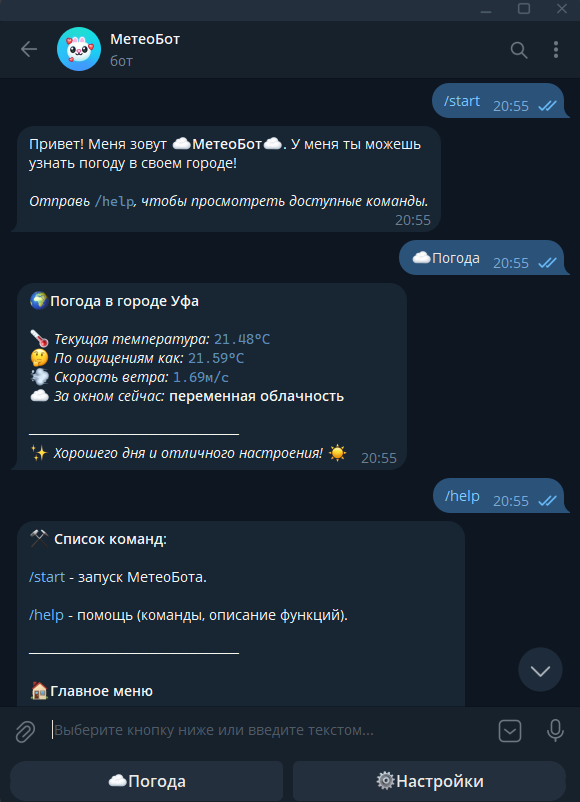
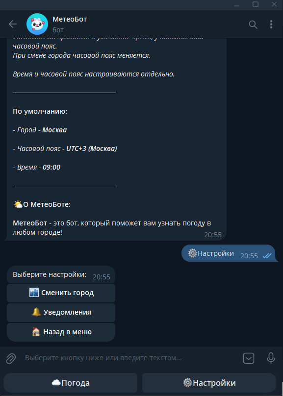
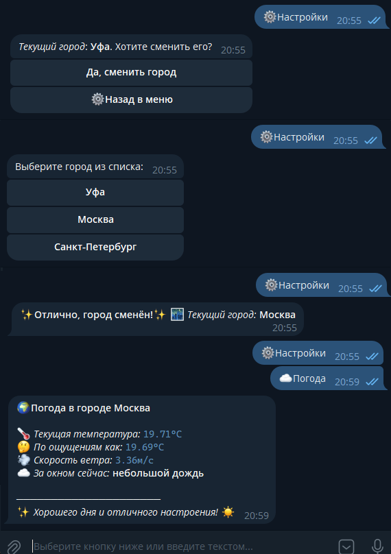
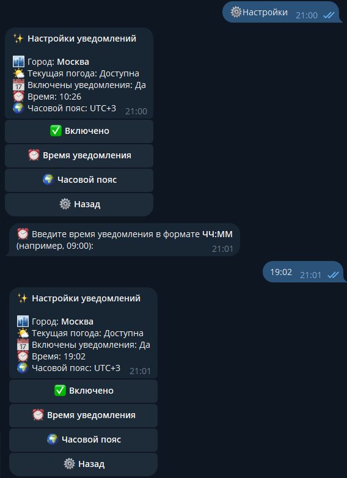
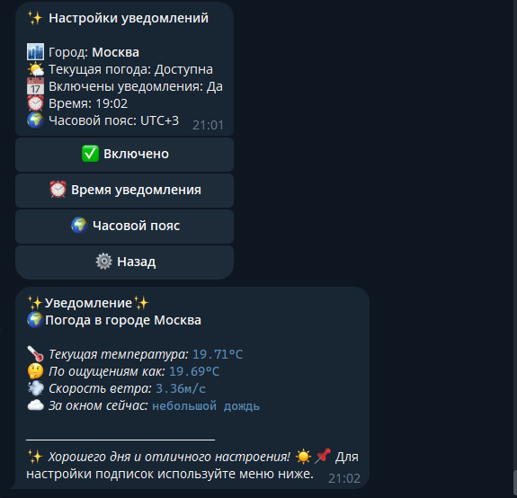
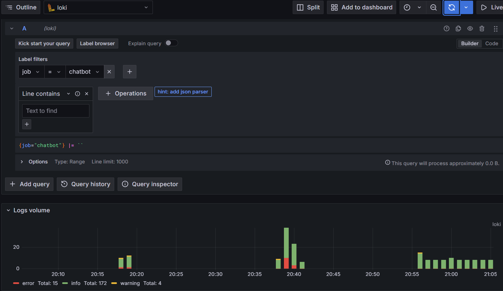
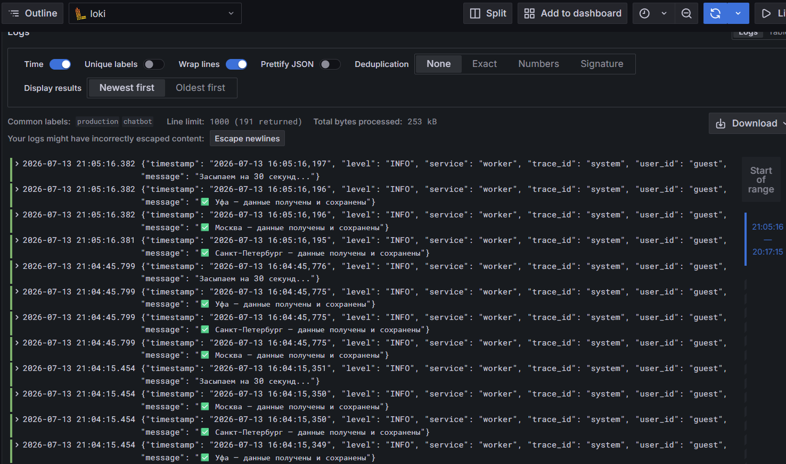
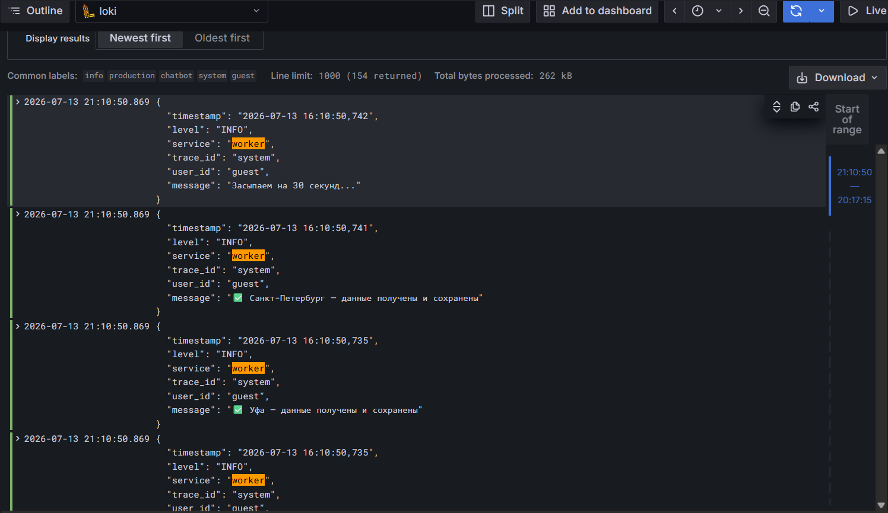
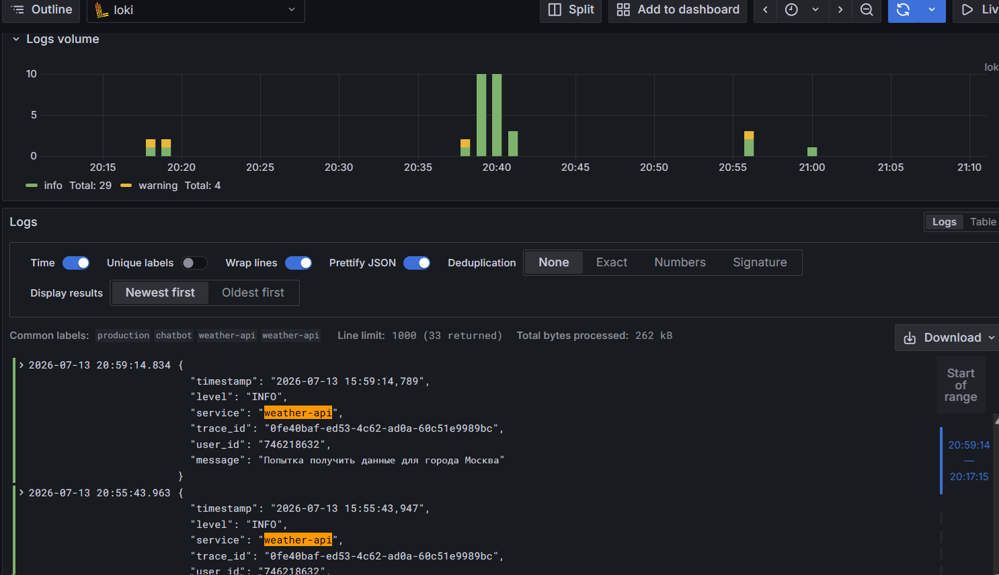

# ☁️ МетеоБот / Weather Telegram Bot

## 📖 Описание проекта
**МетеоБот** — это удобный и интуитивно понятный Telegram-бот для отслеживания прогноза погоды. Бот управляется кнопочным интерфейсом и обычными сообщениями.

## ✨ Основные возможности
* 🌡️ **Текущая погода** — моментальное отображение температуры и реальных ощущений.
* ⚙️ **Гибкие настройки** — быстрая смена города "в один клик".
* 🤖 **Умный UI** — динамические клавиатуры, которые меняются в зависимости от контекста диалога, возможность вручную написать запрос (парсинг через mawo-pymorphy3).

## 🛠️ Технологический стек
### **Ядро & Веб**
* 🐍 **Язык программирования:** Python (v3.12)
* ⚡ **Веб-Фреймворк:** FastAPI (v0.138.2) - асинхронный веб-фреймворк.
* 🤖 **Библиотека бота:** python-telegram-bot (v22.8) - интеграция с Telegram.
### **Базы данных & Производительность**
* 🐘 **База данных:** PostgreSQL (v16-alpine)
* 🗃️ **Кеш:** Redis Sentinel
* 🧱 **Лимитер API:** FastAPI-limiter (v0.2.0)
* 🛑 **Лимитер бота:** pyrate-limiter (v4.4.0)
### **Сервисы & Инструменты**
* 🌤️ **Погодный API:** OpenWeatherMap API
* 📓 **Морфологический анализатор:** mawo-pymorphy3 (v1.0.4) - анализ текста для бота.
* ✨ **Линтер:** Ruff - (v0.15.20) моментальный линтинг и форматирование кода.
### **Инфраструктура & DevOps**
* 🐳 **Контейнеризация:** Docker, Docker Compose, autoheal
* 🔨**Отказоустойчивость:** autoheal - автоматический перезапуск упавших контейнеров.
* 📈 **Мониторинг:** Grafana (v11.0.0)

## 🏗️ Архитектура проекта

```
weather-chatbot
├─ .dockerignore
├─ docker-compose.yml
├─ Dockerfile
├─ promtail-config.yaml
├─ README.md
├─ requirements.txt
├─ docs
│  └─ images
│     ├─ bot_demo_1.png
│     ├─ bot_demo_2.png
│     ├─ bot_demo_3.png
│     ├─ bot_demo_4.png
│     ├─ bot_demo_5.png
│     ├─ grafana_1.png
│     ├─ grafana_2.png
│     ├─ grafana_3.png
│     └─ grafana_4.png
├─ packages
│  ├─ cache
│  │  ├─ base.py
│  │  ├─ redis_cache.py
│  │  └─ __init__.py
│  ├─ core
│  │  ├─ env.py
│  │  └─ __init__.py
│  ├─ db
│  │  ├─ base.py
│  │  ├─ postgres.py
│  │  └─ __init__.py
│  ├─ logging
│  │  ├─ logger.py
│  │  └─ __init__.py
│  └─ redis
│     └─ redis_client.py
├─ telegram_bot
│  ├─ alembic
│  │  ├─ env.py
│  │  ├─ README
│  │  ├─ script.py.mako
│  │  └─ versions
│  │     └─ 3e6292fdfb7e_create_users_table.py
│  ├─ alembic-entrypoint.sh
│  ├─ alembic.ini
│  ├─ main.py
│  ├─ src
│  │  ├─ context.py
│  │  ├─ domain
│  │  │  └─ parsed_data.py
│  │  ├─ handlers
│  │  │  ├─ city.py
│  │  │  ├─ help.py
│  │  │  ├─ notifications.py
│  │  │  ├─ settings.py
│  │  │  ├─ settings_states.py
│  │  │  ├─ start.py
│  │  │  ├─ unknown.py
│  │  │  ├─ weather.py
│  │  │  └─ __init__.py
│  │  ├─ services
│  │  │  ├─ location.py
│  │  │  ├─ user_limiter.py
│  │  │  └─ user_service.py
│  │  ├─ settings
│  │  │  └─ config.py
│  │  ├─ text_analyzer
│  │  │  ├─ analyzer.py
│  │  │  ├─ intent.py
│  │  │  ├─ key_words.py
│  │  │  └─ __init__.py
│  │  └─ utils
│  │     └─ telegram_helpers.py
│  ├─ tasks
│  │  ├─ rq_scheduler.py
│  │  ├─ rq_worker.py
│  │  ├─ weather_tasks.py
│  │  └─ __init__.py
│  └─ __init__.py
├─ weather_api
│  ├─ main.py
│  ├─ src
│  │  ├─ domain
│  │  │  ├─ data.py
│  │  │  └─ exceptions.py
│  │  ├─ repositories
│  │  │  ├─ base.py
│  │  │  └─ __init__.py
│  │  ├─ routers
│  │  │  ├─ weather_router.py
│  │  │  └─ __init__.py
│  │  ├─ services
│  │  │  ├─ weather_service.py
│  │  │  └─ __init__.py
│  │  └─ settings
│  │     └─ config.py
│  ├─ tests
│  │  ├─ conftest.py
│  │  ├─ test_weather.py
│  │  └─ __init__.py
│  └─ __init__.py
└─ worker
   ├─ main.py
   ├─ src
   │  ├─ clients
   │  │  ├─ api.py
   │  │  └─ __init__.py
   │  ├─ models
   │  │  ├─ city_task.py
   │  │  └─ __init__.py
   │  ├─ services
   │  │  ├─ weather_service.py
   │  │  └─ __init__.py
   │  ├─ settings
   │  │  ├─ city_tasks.py
   │  │  └─ config.py
   │  └─ tasks
   │     ├─ weather_tasks.py
   │     └─ __init__.py
   └─ __init__.py

```

* `telegram_bot` — бот-обработчик команд пользователя (управляет диалогом через кнопки, парсинг сообщений пользователя). Берет данные через сервер `weather_api`.
* `weather_api` — эндпоинты, бизнес-логика, запросы к кешу.
* `worker` — обращается к API и обновляет данные в кеше раз в определенное время.

## 🚀 Быстрый запуск
Приложение **полностью** контейнеризовано, для запуска на Windows необходим `Docker Desktop`.

### 1. Клонирование репозитория
```bash
git clone https://github.com/danilpashin/weather-chatbot.git
cd weather-chatbot
```

### 2. Настройка окружения
Создайте `.env` файл в корне проекта, скопировав `.env.example` файл. Вставьте свои токены API и Telegram-бота:
```bash
cp .env.example .env
```

### 3. Установка зависимостей
```bash
pip install -r requirements.txt
```

### 4. Запуск контейнеров
```bash
docker compose up
```

### 5. Использование бота
Бот запускается через команду `/start`


## Демонстрация работы бота







## Логи в Grafana





